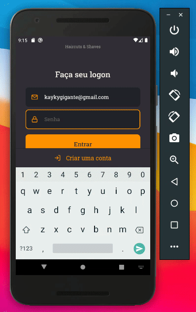

<h1 align="center">
  
</h1>

<h4 align="center">
  GoBarber Mobile
</h4>

<p align="center">
  <a href="#rocket-technologies">Technologies</a>&nbsp;&nbsp;&nbsp;|&nbsp;&nbsp;&nbsp;
  <a href="#runner-how-to-run">How to run</a>&nbsp;&nbsp;&nbsp;|&nbsp;&nbsp;&nbsp;
  <a href="#computer-project">Project</a>
</>

<br>

<p align="center">
  
</p>

<br>

## :rocket: Technologies

This project was developed with the following techs:

- [React Native](https://reactnative.dev/)
- [React Navigation](https://reactnavigation.org/)
- [Async Storage](https://github.com/react-native-community/async-storage)
- [Styled Components](https://styled-components.com/)
- [TypeScript](https://www.typescriptlang.org/)
- [Eslint](https://eslint.org/)
- [Prettier](https://prettier.io/)
- [Axios](https://github.com/axios/axios)
- [Jest](https://jestjs.io/)
- [React Testing Library](https://testing-library.com/docs/react-testing-library/intro)

## :computer: Project

Mobile client to schedule an appointment on a barbershop

## :runner: How to run

> ### Requirements

- Node
- NPM or Yarn

Install dependencies
```
  $ yarn

  # or

  $npm install

```

Edit `./src/services/api.ts` with your current IP address
```
  const api = axios.create({
    baseURL: 'http://192.168.0.105:3333',
  });
```

Install and run on Android
```
  $ yarn android

  # and

  $ yarn start

  # or

  $ npm android

  # and

  $ npm start
```

Install and run on IOS
```

  $ cd ./ios

  $ pod install

  # Go back to previously directory and then run

  $ yarn ios

  # and

  $ yarn start

  # or

  $ npm ios

  # and

  $ npm start
```
---
